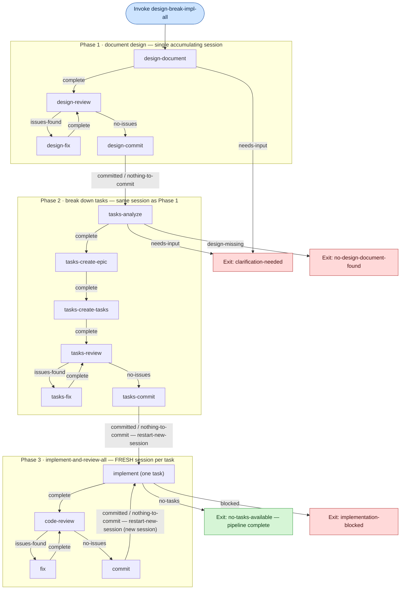

# Untethered

A voice-controlled interface for Claude Code. Speak commands to Claude from your iPhone or Mac while Claude works in your codebase.

## Overview

Untethered connects your iOS/macOS device to a Clojure backend that invokes Claude Code CLI. You speak, Claude codes, you review—all without touching your keyboard.

**Architecture:**
```
┌─────────────┐     WebSocket      ┌─────────────┐     CLI      ┌─────────────┐
│  iOS/macOS  │◄──────────────────►│   Backend   │◄────────────►│ Claude Code │
│     App     │    Port 8080       │  (Clojure)  │              │     CLI     │
└─────────────┘                    └─────────────┘              └─────────────┘
```


## Features

- **Voice Input** — Speak commands via iOS/macOS speech recognition
- **Multiple Sessions** — Run concurrent Claude sessions in different projects
- **Session History** — Full conversation history with delta sync
- **Command Execution** — Run Makefile targets and shell commands
- **Real-time Streaming** — Live command output as it happens
- **Share Extension** — Share files directly to Claude from other apps
- **Session Compaction** — Summarize long sessions to reduce token usage
- **Recipes** — Multi-step agent workflows (design → break down → implement) driven by a state machine

## Prerequisites

### Backend
- Java 11+
- [Clojure CLI](https://clojure.org/guides/install_clojure)
- [Claude Code CLI](https://docs.anthropic.com/en/docs/claude-code) installed at `~/.claude/local/claude`

### iOS/macOS App
- macOS 12.0+ (for development)
- Xcode 15+
- [XcodeGen](https://github.com/yonaskolb/XcodeGen): `brew install xcodegen`

## Quick Start

### 1. Start the Backend

```bash
cd backend
clojure -P                    # Download dependencies
clojure -M -m voice-code.server   # Start server on port 8080
```

The backend generates an API key on first run at `~/.voice-code/api-key`.

### 2. Build the iOS App

```bash
cd ios
xcodegen generate             # Generate Xcode project
open VoiceCode.xcodeproj      # Open in Xcode
```

Build and run on your device or simulator.

### 3. Connect

1. Open the app → Settings
2. Enter your backend URL (e.g., `192.168.1.100:8080`)
3. Scan the QR code: `cat ~/.voice-code/api-key | qrencode -t UTF8`
   (or enter the key manually)
4. Start speaking!

## Project Structure

```
voice-code/
├── ios/                      # iOS/macOS app (Swift/SwiftUI)
│   ├── VoiceCode/           # Main app source
│   ├── VoiceCodeMac/        # macOS-specific code
│   ├── VoiceCodeShareExtension/  # Share Extension
│   └── project.yml          # XcodeGen configuration
├── backend/                  # Clojure WebSocket server
│   ├── src/voice_code/      # Server source
│   └── deps.edn             # Dependencies
├── docs/                     # Documentation
├── scripts/                  # Build scripts
└── Makefile                  # Build automation
```

## Build Commands

### iOS/macOS

```bash
make generate-project    # Generate Xcode project from project.yml
make build               # Build for simulator
make test                # Run unit tests
make deploy-device       # Build and install to connected iPhone
make deploy-testflight   # Deploy to TestFlight
```

### Backend

```bash
make backend-run         # Start WebSocket server
make backend-stop        # Stop server
make backend-test        # Run tests
make backend-nrepl       # Start nREPL for development
```

### API Key

```bash
make show-key            # Display current API key
make show-key-qr         # Display API key with QR code
make regenerate-key      # Generate new key (invalidates existing)
```

## Configuration

### Backend (`backend/resources/config.edn`)

```edn
{:server {:port 8080
          :host "0.0.0.0"}
 :claude {:cli-path "claude"
          :default-timeout 86400000}
 :logging {:level :info}
 :message-stream-version :v0.4.0}
```

`:message-stream-version` gates the append-only message-stream protocol (`:v0.4.0`, default) versus the legacy `last_message_id` / `session_updated` paths (`:v0.3.0`, rollback). Flip the value and restart the backend to switch paths. See [STANDARDS.md](STANDARDS.md#message-stream-version-config-flag) and @docs/design/append-only-message-stream.md.

### Environment Variables

```bash
# For TestFlight deployment
export DEVELOPMENT_TEAM=<team-id>
export ASC_KEY_ID=<key-id>
export ASC_ISSUER_ID=<issuer-id>
export ASC_KEY_PATH="$HOME/.appstoreconnect/private_keys/AuthKey_${ASC_KEY_ID}.p8"
```

## WebSocket Protocol

The app communicates with the backend over WebSocket. Key message types:

| Direction | Type | Purpose |
|-----------|------|---------|
| → | `connect` | Authenticate with API key |
| → | `prompt` | Send query to Claude |
| → | `subscribe` | Subscribe to session history |
| → | `execute_command` | Run shell command |
| ← | `response` | Claude's response |
| ← | `command_output` | Streaming command output |
| ← | `session_history` | Historical messages |

See [STANDARDS.md](STANDARDS.md) for the complete protocol specification.

## Recipes

Recipes are multi-step agent workflows defined as small state machines in
[`backend/src/voice_code/recipes.clj`](backend/src/voice_code/recipes.clj). Each
recipe is a set of named **steps**; every step gives the agent a prompt and a
fixed set of **outcomes**. The orchestrator
([`orchestration.clj`](backend/src/voice_code/orchestration.clj)) reads the
outcome the agent emits at the end of its turn and follows the step's
`:on-outcome` transition — advancing to the next step, looping back, exiting, or
restarting in a fresh session. Guardrails (`:max-step-visits`,
`:max-total-steps`) bound runaway loops.

The flagship recipe, **`:design-break-impl-all`**, chains the full feature
pipeline end to end:

1. **Document design** — write and self-review a design document, then commit it.
2. **Break down tasks** — analyze the design and create an epic plus child tasks
   in the [beads](https://github.com/steveyegge/beads) issue tracker.
3. **Implement & review all** — implement each ready task, code-review it, fix any
   issues, and commit — one **fresh agent session per task** — until no ready
   tasks remain.

Phases 1 and 2 run in a single accumulating session (the design output feeds task
breakdown directly). Phase 2 then hands off via `:restart-new-session` to the
generic `:implement-and-review-all` recipe, which restarts a brand-new session
for each task so no state leaks between implementations. Every step also has an
`:other` escape outcome that exits the recipe immediately (omitted below for
readability).



The **review loops** (`design-review`/`design-fix` and `code-review`/`fix`)
repeat `issues-found → fix → re-review` until a step reports `no-issues`. The
**Phase 3 task loop** ends when `implement` reports `no-tasks` (graceful:
`no-tasks-available`) or `blocked`. Other generic recipes
(`:document-design`, `:break-down-tasks`, `:implement-and-review`,
`:review-and-commit`, `:refine-design`, `:rebase`, `:retrospective`) reuse the
same step vocabulary; see
[`recipes.clj`](backend/src/voice_code/recipes.clj) for the full registry.

## Development

### iOS Development

The project uses XcodeGen to generate the Xcode project from `ios/project.yml`. After modifying the YAML, regenerate:

```bash
cd ios && xcodegen generate
```

### Backend Development

Start an nREPL for interactive development:

```bash
cd backend && clojure -M:nrepl
```

Connect your editor and evaluate code directly.

### Coding Standards

- **JSON**: `snake_case` keys
- **Clojure**: `kebab-case` keywords
- **Swift**: `camelCase` properties
- **UUIDs**: Always lowercase

See [STANDARDS.md](STANDARDS.md) for complete conventions.

## Testing

```bash
# iOS
make test                # Unit tests
make test-ui             # UI tests

# Backend
make backend-test        # Unit tests
```

## Deployment

### iOS/macOS

```bash
make deploy-testflight   # Archive, export, upload to TestFlight
```

### Backend

Run the backend on a machine accessible from your iOS device. For remote access, consider [Tailscale](https://tailscale.com/) for secure networking.

## License

MIT License. See [LICENSE](LICENSE).
