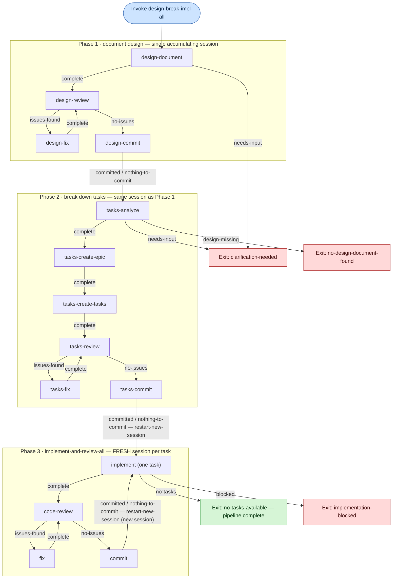

# Recipe flow: `:design-break-impl-all`

The chained `:design-break-impl-all` recipe runs the full pipeline — **document
design → break down tasks → implement & review all tasks**. Phases 1 and 2 share
one accumulating agent session (design output feeds task breakdown directly).
Phase 2's final commit hands off via `:restart-new-session` to the
`:implement-and-review-all` recipe, which runs each task in its **own fresh
session** and loops until no ready tasks remain.

Every step also carries an `:other` outcome that exits the recipe immediately
with `reason "user-provided-other"` (omitted below to keep the graph readable).

**Notes on the loops (matches the code in `backend/src/voice_code/recipes.clj`):**

- **Review loop** (both `design-review`/`design-fix` and `code-review`/`fix`):
  `issues-found → fix → re-review`, repeating until `no-issues`.
- **Phase 3 task loop:** after each `commit`, the `:committed`/`:nothing-to-commit`
  outcomes trigger `:restart-new-session` back into `:implement-and-review-all`,
  so each task is implemented in a brand-new session (state from the prior task
  is not carried forward). The loop ends when `implement` reports `no-tasks`
  (graceful: `no-tasks-available`) or `blocked`.
- Guardrails (`:max-step-visits 10`, `:max-total-steps 100`) bound runaway loops.
